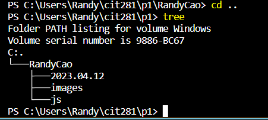
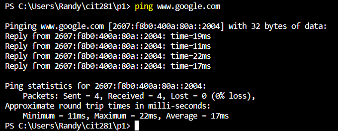
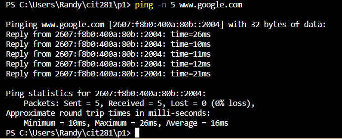

# cit281-p1

# Project 1

In this project, I have learned how to access the command-line interface (CLI) of my operating system. 
Utilizing the CLI is an incredibly valuable technical skill due to its convenience and accessibility for managing and creating files.

### Skills Used in Project
 - Utilized the command line to create a well-organized folder structure

- Utilized ping to determine if internet location is available

- Utilized a command line prompt to specify the desired quantity of data packets to be sent

- Developed a JavaScript program using Visual Studio Code.
- Employed an array in the JavaScript program to generate the desired date output.
- Created a code snippet that produced random letters, ensuring a length ranging from 5 to 25 characters.

